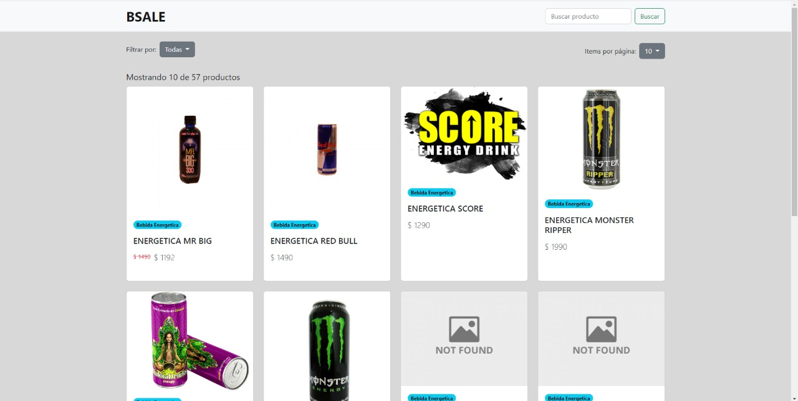
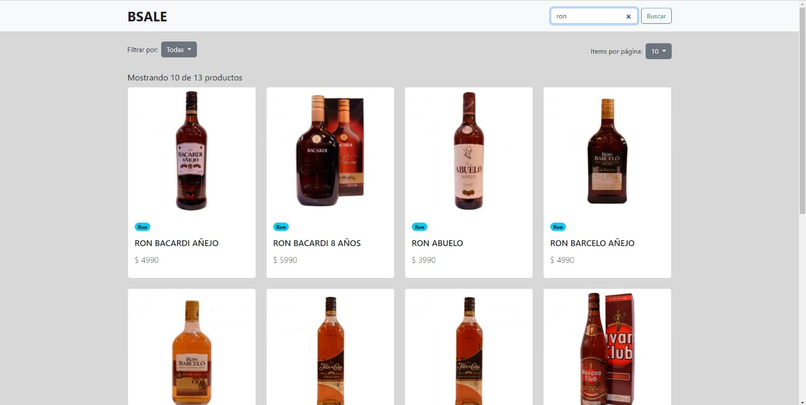

# BSALE - Frontend &middot; [](https://app.netlify.com/sites/bsale-ecommerce/deploys) [](https://www.npmjs.com/package/npm)
> Información acerca del frontend desarrollado para la prueba de BSALE

Este repositorio contiene la parte del frontend que se desarrollo para mostrar los productos que se obtienen desde una [api](https://github.com/ashel1806/bsale-backend) implementada en Node js

## Desarrollo

### Tecnologías
El frontend se desarrollo utilizando HTML, Bootstrap (v5.2) y JavaScript Vanilla.

### Corriendo el frontend en local

Para poder ver el frontend de manera local tendremos que hacer los siguientes pasos:

```shell
git clone https://github.com/ashel1806/bsale-frontend.git
cd bsale-frontend
```
Luego, con ayuda de la extensión [Live Server](https://marketplace.visualstudio.com/items?itemName=ritwickdey.LiveServer) podremos iniciar el frontend.

### Funcionalidades implementadas

La página consta de las siguientes funcionalidades:

- Búsqueda de productos por su nombre
- Búsqueda de productos por su categoría
- Paginación
- Filtrado de items por cantidad

## Referencia de la API

El frontend hace uso de una API para mostrar los productos, la documentación de esta la puedes encontrar [aquí](https://github.com/ashel1806/bsale-backend)


## Algunas imágenes


